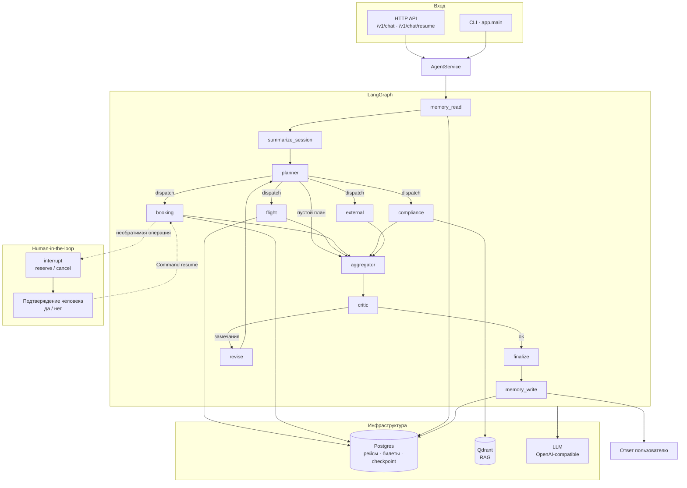

# Agent Runtime Package

Минимальная production-oriented упаковка агента для последующей контейнеризации и API-слоя.

## Архитектура

Мультиагентный runtime на LangGraph: память → планировщик → параллельные субагенты → агрегатор → критик.
Необратимые операции (бронь / отмена) останавливают граф через Human-in-the-loop (`interrupt` → `/v1/chat/resume`).



| Слой | Роль |
|------|------|
| `app/agents` | оркестратор, субагенты, critic, guardrails |
| `app/tools` | flight / booking (HITL) / compliance / external |
| `app/memory` | STM (checkpoint) + LTM (эпизоды, профиль) |
| `app/rag` | retrieval в Qdrant для compliance |
| `app/observability` | логи, метрики, Langfuse |
| `app/api` · `app/service` | HTTP и общий диалоговый слой |

## Состав

- `app/` — runtime-код агента (оркестратор, граф, инструменты, память, observability, API).
- `QUALITY.md` — карточка качества агента и RAG (метрики последнего прогона).
- `eval_reports/` — снимок отчёта валидации (`full_dataset_report.*`).
- `scripts/eval/` — харнесс бенчмарков 
- `datasets/` — золотой датасет для eval.
- `requirements.txt` — runtime-зависимости.
- `checkenv.py` — дефолты параметров и валидация окружения.
- `.env` — реальные значения (секреты), не хранится в git.
- `Dockerfile` / `docker-compose.yml` — образ API и связка с Postgres/Qdrant.

## Быстрый запуск (локально)

1. Установить зависимости:

   ```bash
   pip install -r requirements.txt
   ```

2. Подготовить `.env`:

   ```bash
   python checkenv.py --init
   ```

   Заполнить секреты (`LLM_API_KEY`, `PG_PASSWORD`, …), затем:

   ```bash
   python checkenv.py
   ```

3. CLI:

   ```bash
   python -m app.main
   python -m app.main "Найди рейсы из Москвы в Стамбул"
   ```

4. HTTP API:

   ```bash
   uvicorn app.api:app --host 0.0.0.0 --port 8000
   ```

### API endpoints

| Метод | Путь | Описание |
|-------|------|----------|
| GET | `/health` | liveness |
| GET | `/ready` | readiness (LLM доступен) |
| POST | `/v1/chat` | ход диалога |
| POST | `/v1/chat/resume` | подтверждение HITL |

Пример:

```bash
curl -X POST http://localhost:8000/v1/chat \
  -H "Content-Type: application/json" \
  -d "{\"message\":\"Найди рейсы из Москвы в Стамбул\"}"
```

При `status: interrupted` повторите запрос на `/v1/chat/resume` с тем же `session_id`:

```bash
curl -X POST http://localhost:8000/v1/chat/resume \
  -H "Content-Type: application/json" \
  -d "{\"session_id\":\"...\",\"decision\":\"да\"}"
```

## Docker / Compose

Нужны заполненный `.env` и LLM на хосте.

```bash
docker compose up --build -d
curl http://localhost:8000/health
```

Сервисы: `api` (порт 8000), `postgres` (5432), `qdrant` (6333).  
В контейнере `PG_HOST=postgres`, `QDRANT_HOST=qdrant`, LLM по умолчанию через `host.docker.internal`.

CLI внутри compose:

```bash
docker compose run --rm api python -m app.main "привет"
```

Схема БД и коллекция Qdrant в compose не создаются автоматически — их нужно подготовить заранее.

## Качество 

| Контур | Метрика | Значение |
|--------|---------|----------|
| Agent e2e | pass-rate (n=27) | 100% |
| Tools / planning | pass-rate | 100% |
| vs baseline | Δ pass-rate | +80 п.п. |
| RAG | recall@5 / MRR | 0.975 / 0.917 |
| Memory | multiturn | 75% |

KPI для RAG — **recall@k и MRR**.
Подробности и зоны риска: [QUALITY.md](QUALITY.md). Снимок отчёта: [`eval_reports/`](eval_reports/).

## Тесты / CI

Два трека:

| Трек | Что проверяет | Когда |
|------|---------------|--------|
| Unit (`tests/`, без `tests/eval`) | чистая логика агентов/инструментов/конфига; LLM/БД/Qdrant мокаются | каждый PR (`ci.yml`) |
| Eval | бенчмарки агента и RAG | offline на PR; online вручную (`eval.yml`) |

```bash
pip install -r requirements-dev.txt
ruff check .
pytest --cov=app --cov-report=term-missing
```

Eval-харнесс (`scripts/eval/`, золотой `datasets/`) — см. `scripts/eval/README.md`:

```bash
pip install -r requirements-eval.txt -r requirements-dev.txt
python -m scripts.eval.run_all --offline
```

## Готовность к API/Docker

- Точка входа API: `uvicorn app.api:app`.
- Точка входа CLI: `python -m app.main`.
- Общий слой диалога: `app.service.AgentService`.
